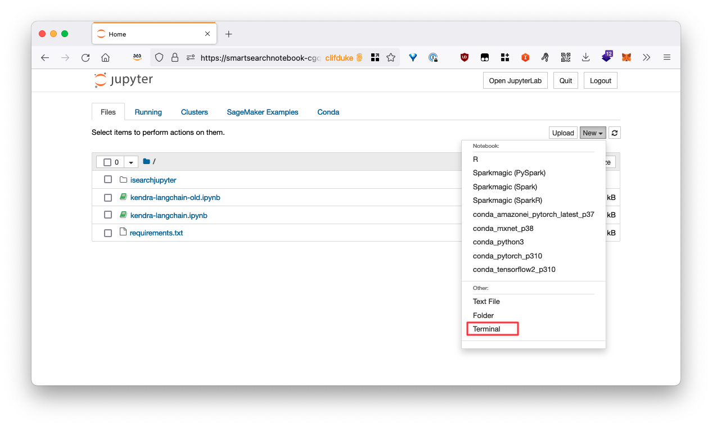
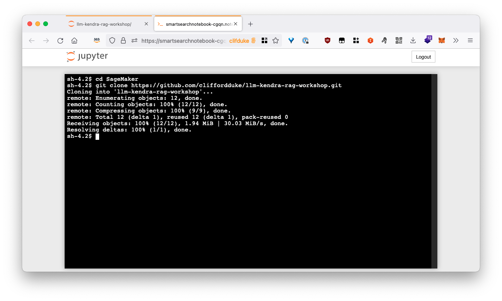
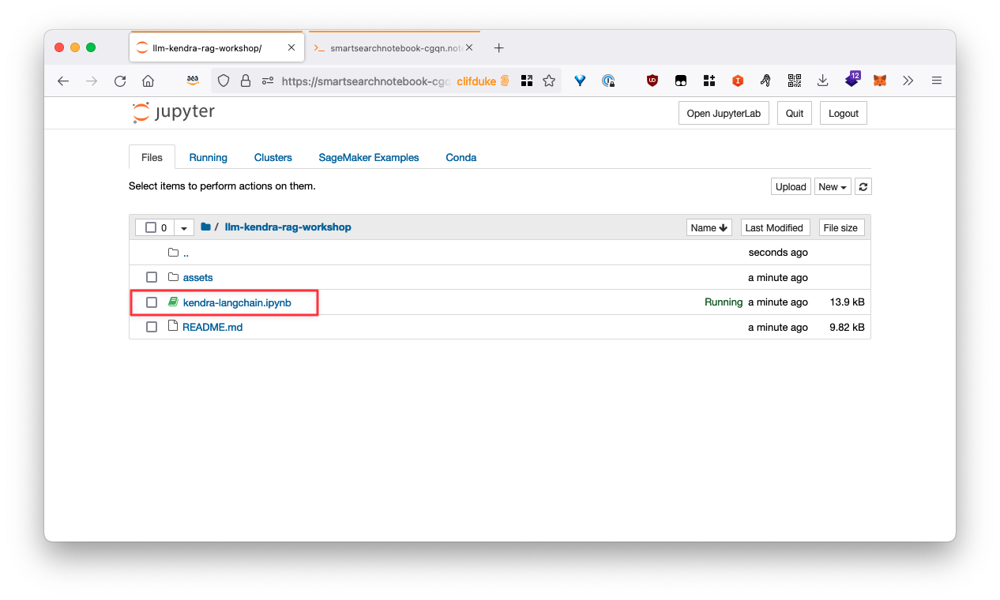

# Enterprise LLM RAG: Soaring LangChain with Falcon Integration & GenAI Workshop

---

Welcome to the LLM RAG workshop!  In this workshop, you will be deploying a pre-built solution that leverages a range of AWS services to implement an end to end Document Retrieval Q&A Chatbot

---

## Environments preparation
Login to [Event Engine](https://dashboard.eventengine.run) (https://dashboard.eventengine.run)
+ Enter Your hashkey for login
  
+ Enter your email and get one time password for login
+ Select AWS console for access console environments
  
+ Select Open Console
  
+ You should now see the console
  

## LLM Workshop Deployment
### Step 1. Create IAM users
+ Search for the IAM service in the search bar at the top of the console and create an IAM user
  
+ Provide a user name, ex:LLM_Deployment
  
+ Attached Admin policy to this user and create user
  
+ Select this user again and click on the security credentials tab
  
+ Find the access key section and create an access key
  
+ Select the `Command Line Interface (CLI)` use case and check the confirmation box to create your access key
  
+ Copy the Access key and Secret access key to local text file (Be careful! the secret key is shown only once!)
  
### Step 2. Create cloud9 instance
+ Create a Cloud9 environment


+ Provide a name, select t3.small instance and create
  
  
+ After instance created, open the Cloud9 IDE
  
  
+ Use `aws configure` and enter the Access key and Secret access key you just record before. leave the region by default
  
  
+ Select force update
  
  
+ Download workshop package to cloud9 instance
  ```javascript
  wget https://jameschiang1001.s3.amazonaws.com/smart_search-v2-k.zip
  ```
  
+ Unzip the download file
  ```javascript
  unzip smart_search-v2-k.zip
  ```
### Step 3. Deploy LLM+Kendra workshop package
+ Use cdk to deploy the AWS Lambda, Amazon Kendra and Amazon SageMaker service
  ```javascript
  cd smart_search-v2/deployment/
  pip install -r requirements.txt
  ```
  
+ Export the related environment variables
  ```javascript
  export AWS_ACCOUNT_ID={your account}
  export AWS_REGION={your region}
  ```
  Find our Account ID in the dropdown in the top right corner of the console:
  
  

  Region:
  
  

  

+ Deploy the project using the Cloud Development Kit (CDK). This process will take around 30 mins
    
   ```javascript
  cdk bootstrap
  cdk deploy --all --require-approval never
  ```
  

  

### Step 4. Import data to kendra from AWS S3
+ Download the archive containing a list of AWS white papers
```javascript
  cd ~
  wget https://jameschiang1001.s3.amazonaws.com/AWS_Whitepapers.zip
  unzip AWS_Whitepapers.zip
  ```
+ Check the Amazon Kendra S3 data source, go to S3 console and look for a bucket name that looks like `smart-search-kendraxxxx`
  

+ Go Back to your Cloud9 IDE, use the following command to upload the white papers to S3
  ```javascript
  aws s3 sync  AWS_Whitepapers s3://{your-s3-bucket}/
  ```
  

+ Go back to the Kendra console and open your index
  

+ Select the S3 data source and click sync now
  

### Step 5. Deploy LLM model
+ Look for the `SmartSearchNotebook` in `SageMaker -> Notebook -> Notebook instances`, click Open Jupyter
  
+  Open LLM_Model/llm-english/code/inference.py and modify line 37 LLM_NAME value to TheBloke/vicuna-7B-1.1-HF (remember to save the file)
  

+  Back to LLM_Model/llm-english/ and open llm_english_sagemaker_byos.ipynb. Run the code sequentially.The second step may take more than 15 mins.
  

+   Change chiness question to english to make sure the model can run well
  

### Step 6. Varifying LLM model with Kendra service
+ go to apigateway and click smart-search-qa-api
  
+ Select stage->prod, record the invoke URL
  
+ back to cloud9 console, select gradio-webpage.py under gradio-web. Change the url to your own url.
 
+ install gradio
  ```javascript
  pip install gradio
  ```
  
  
  if you see following errors
  
  please reinstall fastapi
  ```javascript
  pip install fastapi
  ```
  

+ running gradio for web service
  ```javascript
  python gradio-webpage.py
  ```
  

+ please check the public url. if you can see following page. the deployment is success.
  

## Test LLM Workshop Result
Enter following questions for testing
1. What is aws sagemaker 

2. How to build a web site on aws
   
3. what is aws security best practice
   


## Lab 2 - Langchain with Kendra and 

1. Open a terminal in Jupyter



2. Clone the workshop repository using the following terminal commands

```sh
cd SageMaker
git clone https://github.com/cliffordduke/llm-kendra-rag-workshop.git
```



3. Navigate back to the Jupyter browser and into the cloned workshop folder, open the `kendra-langchain.ipynb` notebook. Make sure it us running the `conda_python3` kernel

